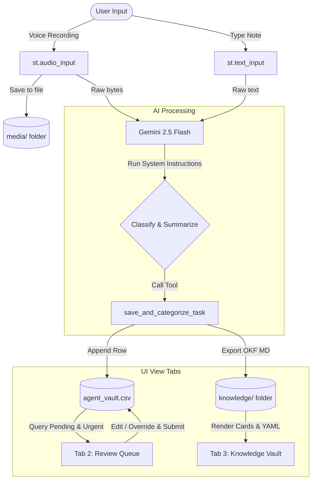

# DaySync AI 🎙️🧠

A highly polished, mobile-friendly Streamlit web application designed as a Capstone Project for the Kaggle Vibecoding Agents Competition. **DaySync AI** serves as a smart daily personal concierge agent that accepts voice recordings or text notes, processes them with Google Gemini API, categorizes them, identifies tasks requiring human review, and maintains a structured knowledge base matching Google's brand new **Open Knowledge Format (OKF)** specification.

---

## 📌 Problem Statement

In a fast-paced digital world, users struggle to capture unstructured thoughts, chores, meetings, and receipts efficiently. Unstructured text or rapid voice memos are easy to record but hard to organize. 

Existing solutions fail in three ways:
1. **Lack of Structure**: Voice recordings remain as raw audio files or simple unstructured text transcripts without actionability.
2. **Fragility of Automation**: AI models frequently misclassify deadlines, mistake general notes for critical tasks, or misinterpret financial expenses without user validation.
3. **Information Silos**: Transcribed tasks are saved in proprietary databases, preventing other AI agents or systems from easily indexing or referencing them.

**DaySync AI** addresses these issues by:
- Accepting hands-free voice notes (`st.audio_input()`) or text.
- Standardizing outputs using a **local CSV vault** (`agent_vault.csv`).
- Integrating a **human-in-the-loop (HITL) verification queue** to resolve ambiguous, deadline-driven, or financial transactions.
- Syncing every task/note as a concept file conforming to **Google's Open Knowledge Format (OKF)**, creating a portable, standard external brain directory (`knowledge/`) that other agents can instantly navigate.

---

## 🏗️ Architecture Flow



---

## 📂 Database Schema

All tasks are tracked dynamically inside `agent_vault.csv` with the following columns:

| Field | Type | Description |
| :--- | :--- | :--- |
| `id` | `UUID` | Unique identifier generated upon capture. |
| `timestamp` | `Datetime` | Record creation timestamp (`YYYY-MM-DD HH:MM:SS`). |
| `text_source` | `String` | Origin of the task: `'voice'` or `'text'`. |
| `transcript` | `Text` | Verbatim text input or transcription output. |
| `category` | `Enum` | Classified strictly into `'Todo'`, `'Reminder'`, `'Expense'`, or `'General Note'`. |
| `summary` | `Text` | Concise, actionable one-sentence summary. |
| `urgent_flag` | `Boolean` | True if the task has strict deadlines, financial transactions, or ambiguous text. |
| `review_reason` | `Text` | Detailed reason why the task was flagged for review. |
| `review_status` | `Enum` | State of validation: `'Pending'` (needs review) or `'Resolved'` (completed). |
| `audio_path` | `String` | Relative path to local audio file under `media/` (or empty if text). |

---

## 📑 Google Open Knowledge Format (OKF) Compliance

The `knowledge/` directory is a conformant **[Open Knowledge Format (OKF) v0.1](https://cloud.google.com/blog/products/data-analytics/how-the-open-knowledge-format-can-improve-data-sharing)** bundle — the open, vendor-neutral spec Google Cloud published for giving AI agents curated context ([spec](https://github.com/GoogleCloudPlatform/knowledge-catalog/blob/main/okf/SPEC.md)). It is a directory of Markdown files with YAML frontmatter, which means any OKF-aware agent can index DaySync's notes with zero translation.

We follow the spec's conventions:

- **Concept files** — every note is a `knowledge/<id>.md` concept document. Frontmatter leads with the spec's required/recommended fields: a descriptive **`type`** (the note's category — the only field OKF *requires*), **`title`**, **`description`**, **`tags`**, an **ISO 8601 `timestamp`**, and a **`resource`** URI for voice memos. DaySync-specific keys (`id`, `review_status`, …) are preserved as OKF *extended fields*, which consumers must tolerate.
- **`index.md`** — a bundle-root index for progressive disclosure. Per spec, it is the one place frontmatter is allowed in an `index.md`, and it declares the targeted version via `okf_version: "0.1"`. Concept links use OKF's absolute, bundle-relative form (`/<id>.md`).
- **`log.md`** — the reserved change-history file, with ISO 8601 date headings (`YYYY-MM-DD`).

An example concept file:

```yaml
---
type: Expense
title: Purchase office monitors for $450
description: Purchase office monitors for $450
resource: media/voice_d94f24ef-9b2f-410a-8bfb-c744047a060a.wav
tags:
- expense
- voice
- urgent
timestamp: '2026-07-02T20:36:20'
id: d94f24ef-9b2f-410a-8bfb-c744047a060a
category: Expense
urgent_flag: true
review_reason: Contains a financial transaction requiring verification
review_status: Pending
text_source: voice
audio_path: media/voice_d94f24ef-9b2f-410a-8bfb-c744047a060a.wav
---
# Expense: Purchase office monitors for $450

**Logged on:** 2026-07-02T20:36:20 via *voice*

## Verbatim Transcript
Just bought three office monitors from the store today for four hundred and fifty dollars, please add that.

## Structured Summary
Purchase office monitors for $450
```

And the bundle-root `knowledge/index.md`:

```markdown
---
okf_version: "0.1"
---
# DaySync AI Knowledge Bundle

## Concepts

- **Expense** — [Purchase office monitors for $450](/d94f24ef-9b2f-410a-8bfb-c744047a060a.md) · `2026-07-02T20:36:20`
```

---

## 🚀 Setup & Installation Instructions

### Prerequisites
- Python 3.10 or higher.
- A Gemini API Key from Google AI Studio.

### Step-by-Step Launch

1. **Clone or Navigate to the Directory:**
   ```bash
   cd daysync_ai
   ```

2. **Install Dependencies:**
   It is recommended to run in a virtual environment:
   ```bash
   # Create a virtual environment
   python -m venv venv
   
   # Activate virtual environment
   # On Windows:
   .\venv\Scripts\activate
   # On macOS/Linux:
   source venv/bin/activate
   
   # Install packages
   pip install -r requirements.txt
   # OR let pip install project dependencies from pyproject.toml:
   pip install .
   ```
   *Note: In the development environment, you can simply run:*
   ```bash
   pip install streamlit google-genai pandas python-dotenv pyyaml
   ```

3. **Configure Environment Variables:**
   Create a `.env` file in the root directory:
   ```env
   GEMINI_API_KEY=your_gemini_api_key_here
   ```
   *Fallback: You can also enter the API key directly in the Streamlit Sidebar during execution.*

4. **Run the Streamlit Server:**
   ```bash
   streamlit run app.py
   ```

5. **Interact in your Browser:**
   The terminal will print local URLs (typically `http://localhost:8501`). Open the URL in your desktop or mobile browser.

---

## 🛠️ Verification & Testing

Run the integrity test to verify CSV operations, OKF round-trip, cross-linking, and bundle conformance:
```bash
python tests/test_db.py     # or: pytest tests/
```
It runs against a throwaway temp directory (never touches your real data) and validates capture,
the agenda/completion flow, the needs-a-detail (inbox) + resolve flow, concept cross-linking, OKF
conformance (`type` on every concept, `okf_version` in the index), and delete.

### Sample data
A curated, feature-complete OKF bundle lives in [`examples/`](examples/) — load it in the app via
**☰ Menu → Load demo data**, or regenerate it with `python scripts/build_examples.py`.
